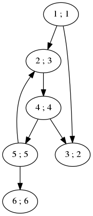
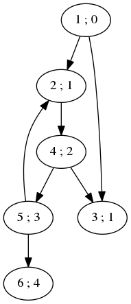

```c++
/*
Copyright 2018 Pierre-Edouard Portier
peportier.me

Licensed under the Apache License, Version 2.0 (the "License");
you may not use this file except in compliance with the License.
You may obtain a copy of the License at

    http://www.apache.org/licenses/LICENSE-2.0

Unless required by applicable law or agreed to in writing, software
distributed under the License is distributed on an "AS IS" BASIS,
WITHOUT WARRANTIES OR CONDITIONS OF ANY KIND, either express or implied.
See the License for the specific language governing permissions and
limitations under the License.
)
*/

```
# Parcours en largeur (breadth-first search)

Répertoire GitHub correspondant à cet article : https://github.com/peportier/ia02-bfs

## Structure FIFO

En utilisant pour $y$ (la structure qui contient les nœuds rencontrés mais dont les successeurs n'ont pas encore été calculés, c'est-à-dire les nœuds gris) une structure de file FIFO (First In First Out) au lieu d'un ensemble, nous obtenons le programme de recherche en largeur dans un graphe.

```c++
#include <iostream>
#include <vector>
#include <set>
#include <queue>
#include <map>
#include <functional>
#include <limits>

using namespace std;

struct
node
{
  int val;
  vector< node* > nei;
  node() {};
  node(int i) : val(i) {}
};

```

Nous suivons le schéma de l'algorithme générique dérivé précédemment. Pour ne pas avoir à chercher la présence d'un nœud dans la file `y` afin de savoir s'il est gris, l'ensemble `x` contient les nœuds gris et les nœuds noirs. 

```c++
typedef function<void(node*)> Visitor;

void
breadth( node* src, Visitor f )
{
  set<node*> x;                   // x is the set of black and grey nodes

  queue<node*> y;                 // y is the queue (FIFO) of grey nodes

  y.push(src); x.insert(src);     // at the beginning, the source is the only grey node

  while( !y.empty() )             // there are still grey nodes
  {
    node* u = y.front();          // u is the 'oldest' element of y

    f(u);                         // visit u

    for( node* n : u->nei )       
    {
      if( x.end() == x.find(n) )  // n is a white successor of u
      {                                 
        y.push(n); x.insert(n);   // n becomes grey
      }
    }
    
    y.pop();                      // u becomes black
  }
}

```

Nous utilisons un visiteur trivial :

```c++
Visitor visit = [](node* v){
  cout << v->val << " ; ";
};

```



## Calcul des plus courts chemins

L'algorithme de recherche en largeur permet de trouver les plus courts chemins d'un nœud source aux autres nœuds du graphe dans le cas d'un graphe orienté pour lequel les arêtes ont toutes le même coût (ou poids) :

```c++
void
findDistances( node* src, map<node*,size_t>* distances )
{

  // local function used to return infinity when
  // for a node we do not yet know a distance to the source

  function<size_t(node*)>
  distance = [&]( node* v )
  {
    map<node*,size_t>::iterator distIt = distances->find(v);
    if( distances->end() == distIt )
    {
      return numeric_limits<size_t>::max();
    }
    return distIt->second;
  };

  Visitor
  visit = [&]( node* v )
  {
    // update the shortest known distance to the
    // successors of the currently visited node

    size_t vDist = distance(v);

    for (node* n : v->nei)
    {
      size_t nDist = distance(n);
      (*distances)[n] = min( nDist, 1 + vDist );
    }
  };
  
  // distance from the source to the source is zero
  if( distances->empty() ) (*distances)[src] = 0;
    
  breadth(src, visit);
}
```

Le programme principal calcule les plus courtes distances au noeud source 1 sur notre exemple filé.

```c++
int
main()
{
  // example of a graph
  node n1(1); node n2(2); node n3(3);
  node n4(4); node n5(5); node n6(6);
  n1.nei.push_back( &n2 );
  n1.nei.push_back( &n3 );
  n2.nei.push_back( &n4 );
  n4.nei.push_back( &n3 );
  n4.nei.push_back( &n5 );
  n5.nei.push_back( &n2 );
  n5.nei.push_back( &n6 );

  breadth(&n1, visit); cout << endl;

  map<node*,size_t> distances;
  findDistances(&n1, &distances);

  for( const auto& p : distances )
  {
    cout << (p.first)->val << " : " << p.second << " ; ";
  }
  cout << endl;

  return 0;
}
```

Nous trouvons bien :

